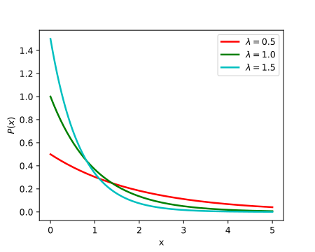

```{r setup, include = FALSE}
knitr::opts_chunk$set(echo = TRUE)
```

# What Problem are We Trying to Solve?

- understand structure in streams of documents, particularly bursty developments in events
- idea: model arrival times of words 
- modeling approach: messages are emitted in a probabilistic manner, so that the gap $x$ in time between messages $i$ and $i + 1$ is distributed according to the "memoryless" exponential density function
- burstiness: changes the PDF from which these gaps in time are drawn (model with several states)
  - exponential distributions with higher rates have more density of short gaps



# Two-state model

- Two states: $q_0$ and $q_1$

- In state $q_0$: messages are emitted at a slow rate, $f_0(x) = \alpha_0 e^{-\alpha_0 x}$

- In state $q_1$: messages are emitted at a faster rate, $f_1(x) = \alpha_1 e^{-\alpha_1 x}$

- Between messages, state changes with probability $p \in (0, 1)$, remaining in its current state with probability $1-p$, independently of previous emissions and state changes.

- Now, the objective is to find a _likely state sequence, given a set of messages_. The set of messages define a sequence of n inter-arrival gaps $\mathbf{x} = (x_1, x_2, ..., x_n)$. Hence, using Bayes, we want to estimate: $Pr(\mathbf{q} | \mathbf{x})$.

- Let's start with the likelihood. Each state sequence $\mathbf{q}$ induces a density function $f_{\mathbf{q}} = \prod_{t = 1}^{n} f_{it}(x_t)$. 

- For the prior, let $b$ denote the number of state transitions in sequence $\mathbf{q}$. The prior probability of $\mathbf{q}$ is then
\begin{align}
\left(\prod_{i_t \neq i_{t+1}} p\right) \left(\prod_{i_t = i_{t+1}} 1-p\right) = p^b (1-p)^{n-b} = \left(\frac{p}{1-p}\right)^b(1-p)^{n}
\end{align}

- We can put these together for the posterior to:
\begin{align}
Pr(\mathbf{q} | \mathbf{x}) &= \frac{Pr(\mathbf{q}) f_{\mathbf{q}}(\mathbf{x})}{\sum_{\mathbf{q'}}Pr(\mathbf{q'}) f_{\mathbf{q'}}(\mathbf{x})} \\ &= \frac{1}{Z} \left(\frac{p}{1-p}\right)^b(1-p)^{n} \prod_{t = 1}^{n} f_{it}(x_t)
\end{align}
where $Z$ is the normalizing constant

- Finding a state sequence $\mathbf{q}$ maximizing this probability is equivalent to finding one that minimizes
\begin{align}
-\ln Pr(\mathbf{q} | \mathbf{x}) = b \ln \left(\frac{1-p}{p}\right) - n\ln(1-p) + \left(\sum_{t = 1}^{n} -\ln f_{it}(x_t)\right) + \ln Z
\end{align}

- Retaining only the non-constant terms (in terms of $\mathbf{q}$) we can write this as the following cost function to minimize:
\begin{align}
c(\mathbf{q} | \mathbf{x}) = b \ln \left(\frac{1-p}{p}\right) + \left(\sum_{t = 1}^{n} -\ln f_{it}(x_t)\right)
\end{align}

- Let's unpack this: 
  - The first term favors sequences with a small number of state transitions
  - The second term favors state sequences that conform well to the sequence $x$ of gap values


# Infinite-state model

- We can easily extend this to multiple states, in fact infinite states

- Consider a sequence of $n + 1$ messages that arrive over a period of time of length $T$.

- If the messages were spaced completely evenly over this time interval, then they would arrive with gaps of size $T/n$

- Again, we are going to first define a base state $q_0$, in which we model the gaps $\mathbf{x}$ using an exponential PDF with base rate $\alpha_0 = n/T$, i.e. $f_0(x) = \alpha_0 e^{-\alpha_0 x}$ (see lecture slides!)

- For higher-order states, we have $f_i (x) = \alpha_i e^{-\alpha_i x}$ with $\alpha_i = \frac{n}{T} s^{i}$

- As before, we will also assume that it is costly to move to a higher state. For every $i, j$ states, there is a cost $\tau(i, j)$ associated with a state transition between $q_i$ and $q_j$. We usually set $\tau(i, j) = (j-i) \gamma \ln n$

- This model has two important parameters (that we usually do not estimate)
  - $s > 1$: a scaling parameter; you can think of this as the distance between the states: if $s$ is large, the probability of a target event needs to be high to enter a bursty state
  - $\gamma > 0$: defines the cost of transitioning between states and affects the beginning of a burst. We assume that there is only costs of moving up, not down.


- By analogy of what we had with the two-state model, we want to find a sequence $\mathbf{q}$ given a sequence of gaps $\mathbf{x}$ that minimizes the cost function:
\begin{align}
c(\mathbf{q} | \mathbf{x}) = \left(\sum_{t=0}^{n-1} \tau(i_t, i_{t+1})\right) + \left(\sum_{t = 1}^{n} -\ln f_{it}(x_t)\right)
\end{align}
  
  
These examples and explanations are inspired by [Kleinberg J., Bursty and Hierarchical Structure in Streams. Data Mining and Knowledge Discovery 7, 373–397 (2003).](https://link.springer.com/article/10.1023/A:1024940629314).

