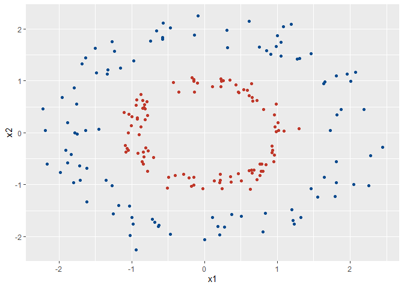

Some Background on SVM with Kernel Tricks
================
Elisa Wirsching
March 9, 2023

# What Problem are We Trying to Solve?

- SVM is a simple and often effective method to separate data points
  into classes using lines/hyperplanes
- However, high-dimensional data are often not linearly separable
- Work-around: First apply a non-linear, high-dimensional transformation
  to the data points before applying SVM
  
  Achieve non-linear decision boundary while using SVM
- Great, problem solved? Not really, because high-dimensional
  transformations are computationally costly
- Kernel methods allow us to get distance measures of data points in
  high-dimensional space without having to locate the data points
  themselves

# Running Example

Let’s assume with have the following data

``` r
# simulate data
circles <- function(n, mu, sigma) {
    lr <- Map(rlnorm, n = n, meanlog = mu, sdlog = sigma)
    N <- length(lr)
    n <- lengths(lr, FALSE)
    data.frame(group = rep.int(gl(N, 1L), n),
               r = unlist(lr, FALSE, FALSE),
               theta = runif(sum(n), 0, 2 * pi))
}

set.seed(789342)
d <- circles(n = c(100, 100), mu = log(c(1, 2)), sigma = c(0.1, 0.1)) %>% 
  mutate(x1 = r * cos(theta),
         x2 = r * sin(theta))

# plot non-transformed data in two dimensions
ggplot(d, aes(x = x1, y = x2, color = group)) +
  geom_point() +
  scale_color_manual(values = c('#BF382A', '#0C4B8E')) +
  theme(legend.position = "none")
```

<!-- -->

As we have seen in lecture, this is impossible to separate linearly.
Let’s apply a 2nd degree polynomial mapping to the data. That is, we
apply the following transformation:

``` r
poli <- function(x1, x2){
  transform <- data.frame(x1 = x1^2, x2 = sqrt(2)*x1*x2, x3 = x2^2)
  return(transform)
}

out <- purrr::map2_dfr(d$x1, d$x2, poli) %>% 
  mutate(group = d$group)

fig <- plot_ly(out, x = ~x1, y = ~x2, z = ~x3, color = ~group, 
               colors = c('#BF382A', '#0C4B8E'))
scene <- list(camera = list(eye = list(x = 1.25, y = -1.25, z = 0)))
fig <- fig %>% add_markers(marker = list(size = 3)) %>% layout(scene = scene)

fig
```

<div id="htmlwidget-2d04a2f5d651ec862f7d" style="width:672px;height:480px;" class="plotly html-widget"></div>
<script type="application/json" data-for="htmlwidget-2d04a2f5d651ec862f7d">{"x":{"visdat":{"2b7455d6a6a":["function () ","plotlyVisDat"]},"cur_data":"2b7455d6a6a","attrs":{"2b7455d6a6a":{"x":{},"y":{},"z":{},"color":{},"colors":["#BF382A","#0C4B8E"],"alpha_stroke":1,"sizes":[10,100],"spans":[1,20],"type":"scatter3d","mode":"markers","marker":{"size":3},"inherit":true}},"layout":{"margin":{"b":40,"l":60,"t":25,"r":10},"scene":{"camera":{"eye":{"x":1.25,"y":-1.25,"z":0}},"xaxis":{"title":"x1"},"yaxis":{"title":"x2"},"zaxis":{"title":"x3"}},"hovermode":"closest","showlegend":true},"source":"A","config":{"modeBarButtonsToAdd":["hoverclosest","hovercompare"],"showSendToCloud":false},"data":[{"x":[0.43591082958259,0.703596883344542,0.583594098602835,0.412639079559784,0.0169571967524352,0.71824944455889,0.246068362999494,0.62300213856249,0.703917583922748,0.968574030682951,0.869106064060798,0.0222609981790562,0.00962415397584097,0.649697565856254,0.0657790041751079,0.0477587067419088,1.09993129012759,0.610870877008505,0.700224545162929,0.258939239033468,0.052226759370097,0.378059111827584,0.513450567973068,0.854346381770354,0.0490570293437378,0.66596793641246,0.134093718817936,0.395712095193238,1.02778618018241,0.0318493306540192,1.18678962315867,0.45569543708764,0.011009453629457,0.762418666118826,0.0467388887311781,0.211999010585513,1.13976773562698,0.416337516891681,0.91255146577573,0.676219215594584,0.595245434079861,0.120094614524393,1.69175651827526,0.217951668805461,0.081451736079106,1.08193421579016,1.16442635617428,0.696260300883969,0.585160708575322,0.287488637210766,1.01451136875716,0.0437741289107483,0.933971939123524,0.998309340937133,0.262163884902059,1.00548918977005,0.728563692365299,0.918753241156187,0.188853596879977,0.046054609225311,0.0490776881844901,0.619851205557783,0.485791676339012,0.34252705830004,0.0224856579653262,1.10086567022228,0.732021786261659,0.96720142334502,0.669221429222708,0.165614454016774,0.859582778837644,0.378263928876205,1.19134058668794,0.0299418512042914,0.126147466209785,0.610151010967812,0.770449392072182,0.020228883602875,0.128529297221995,0.865471119905248,0.86478704156818,0.8818402330024,0.184498492653943,0.221131053915806,0.622967512180872,0.0222059549644313,0.724765945626898,0.428656412982687,0.865851355554696,0.000675884112935044,0.811379190392258,0.835047896744999,0.0209931216298332,1.22811846798532,0.424495459395919,0.520966283042431,0.908319790779253,0.0560600685804898,0.662009306562142,0.647387715956193],"y":[0.568023860156163,0.71605279765665,-0.651805403399222,-0.652258034514344,-0.171307797155854,-0.731116992523352,0.603282691883025,-0.678222973665208,0.440013065419958,0.773993124640347,-0.444837422314813,-0.21764796223664,-0.1328165285804,-0.844284825902077,0.364478167738756,-0.24849735548754,0.491414752490944,-0.826066237993922,-0.575546363644919,-0.666641505328478,0.321080206675117,0.618338948795937,0.637781014550753,-0.345494787898507,0.2791852205541,-0.286804371965211,-0.490642315682609,-0.965821022623099,0.068211229634512,0.261577380985902,0.0520833911023026,-0.689407475023828,0.132626184587827,-0.908988582714076,0.265511325019954,0.513542271037809,0.447774468904355,0.865686697151769,0.464297815117038,-0.632860570205902,0.382800962242948,0.497857363269667,0.138092563858822,-0.521424685917745,0.322841055166584,-0.534218208718354,0.570468724977315,0.541213733313714,-0.895359172428115,0.631488763659219,0.275475204820271,-0.285961325092094,0.149137535003525,-0.43254654317441,0.775254115160477,-0.188894925598138,-0.573910369243601,-0.580354025976431,0.569107356194232,-0.276832675543368,0.326663132959545,-0.37438528297887,0.469851883062998,0.674467119264375,0.212521580771795,-0.00178369264460237,0.670238257188639,0.0233702062608214,-0.528514933698154,0.476021578032077,-0.37679937294101,-0.632858505246499,0.375603317956027,-0.261034125043624,-0.395690232221719,0.815013159819205,-0.142567427478111,-0.158145971445118,-0.430839951666391,-0.504813176242225,-0.330118163335957,-0.707760979934169,-0.589044775354243,0.515808438333282,-0.66484022554656,0.179705338528873,-0.750347776498284,-0.720575760008764,-0.831025382061404,0.0398139807041933,0.0441626789467363,0.50687559203499,-0.202904942823663,-0.623227968898057,0.628886898248693,-0.924661682844848,-0.753156815160095,-0.359344542515441,0.51626213559812,0.326673764653288],"z":[0.370088426130253,0.364364610737508,0.363994671054372,0.515511696132111,0.865306978353505,0.372107532282654,0.739530270956402,0.369169199859125,0.13752426573955,0.309251197127452,0.113841302272771,1.06398273529194,0.916456153363173,0.548575910323028,1.00977763667994,0.646488775523243,0.109774338239675,0.558534917309481,0.23653385117185,0.858137411474317,0.986970093127803,0.505665706283035,0.396108844642201,0.0698584619845207,0.794426287308317,0.0617572883624641,0.897618039310403,1.17864763179049,0.00226349212412369,1.07416270355448,0.00114286457169028,0.521491579613208,0.798845493624736,0.541867795361512,0.75414997689949,0.621997393795129,0.0879573832173279,0.900007118287774,0.118115234705806,0.296141023565248,0.123089206824951,1.03194450118944,0.00563602267439293,0.623724756443817,0.63980433025914,0.131888376558006,0.139740295490415,0.210346837781422,0.684998185885518,0.693554469659775,0.0374005609043771,0.934043480512841,0.0119072123129312,0.0937066820573373,1.14626570951561,0.0177432503898358,0.226042771124107,0.183297745455134,0.85749805199693,0.832015856149977,1.08714169699489,0.11306289223479,0.227217553089347,0.664043736028448,1.00431622600035,1.44502619005559e-06,0.306834666556422,0.000282343743242461,0.208696272223679,0.684108594559021,0.0825852791285122,0.529405339880965,0.0592097062905363,1.13785239884441,0.620586225708645,0.544329550175511,0.0131906596246767,0.618179153514074,0.722104095968453,0.147224059270552,0.0630085769825412,0.284022879638795,0.940315940745748,0.601585214614677,0.354763705058561,0.727147486957984,0.388416280519999,0.605647565493413,0.398800083409165,1.17265151612331,0.0012018685189656,0.153837203112721,0.98056917280389,0.158133401354177,0.46584565515928,0.820589792038259,0.312249713140928,1.15169766560517,0.201301243056855,0.0824202760436473],"type":"scatter3d","mode":"markers","marker":{"color":"rgba(191,56,42,1)","size":3,"line":{"color":"rgba(191,56,42,1)"}},"name":"1","textfont":{"color":"rgba(191,56,42,1)"},"error_y":{"color":"rgba(191,56,42,1)"},"error_x":{"color":"rgba(191,56,42,1)"},"line":{"color":"rgba(191,56,42,1)"},"frame":null},{"x":[0.375190485229445,2.62310947666593,0.515527925197904,0.547976470513233,3.30419824604945,4.20144080466484,1.76102412818282,2.20064400034887,3.20989309675532,0.404741050175434,3.3616558192609,5.98211312683944,0.336286011306455,1.83684574980058,0.943380469195033,2.25694160167332,1.04648866980841,2.69168972658085,3.28550531501583,1.39312926302972,2.10145011606034,4.28642018747946,5.21220318707838,2.67962073969917,3.17437092277471,0.252371517266935,3.24064940914196,2.13047329209017,2.69835483911638,1.10035855046406,0.0429691121691458,1.58095769786172,1.66794781884413e-05,0.324705132008607,1.47196424503954,0.136305137783275,0.643450580100575,1.43813997359717,0.470315464781948,0.732095120284443,3.26507807073395,2.74480399040214,0.970239578648531,4.92288089215344,1.06912571624156,1.4119329665742,3.538086469789,1.16556702382273,0.692061359105227,0.433020988676097,3.20314640860094,3.83451068669185,3.64141288451819,1.61560527038601,0.0329088759553086,4.042862363364,2.67540664732018,0.396528304803711,1.61939565980646,3.51912961060987,1.33385395803211,0.0201962526243105,0.330459725305684,1.54113506201683,4.66379406922974,1.00318852157608,1.7959909138799,0.572295976008404,0.223053443566923,0.822605366752425,1.62070237445693,3.83444621245902,3.92485032691448,0.00825429109235368,1.00264704756284,3.0537200699503,1.74561075924507,0.0963454822976412,1.1069613905816,2.90631102702731,4.78385948774126,0.0125376605213639,3.28044881362124,1.51664292175554,0.890082463786819,0.100143160276526,1.70686323504942,2.84660429599709,0.076524632646207,4.79795785148187,2.41538403040193,3.09412020067607,0.218039677756715,3.55723661158647,2.61636202468022,2.13140380947417,2.97519826198388,0.974549107603777,2.95682284591052,5.08288454218697],"y":[1.86412215723001,3.05830236556071,1.69544655932748,-1.85012135327511,0.897086093898959,-2.88344607710029,-2.28793555581476,-2.42313968301607,-3.11178060370945,1.62680353057896,1.08178688336955,-0.974258370306319,-1.48070458219286,1.75125879063814,-1.91132426046229,-3.45375996239199,2.86660771068498,2.19408594468347,-1.42891872984441,2.34723705259471,-0.138723688184816,3.40500629732638,-1.43501339122261,-0.0990324087239837,0.0158550344107068,-1.14234917901503,2.45395144472733,3.14017159242679,-1.9950655534665,2.1979574109757,-0.578420794743268,2.77709862889633,-0.0119215186466385,-1.70959417551055,-2.90903889154635,-0.82035501605063,-2.1662033542391,-2.52269020289956,1.67718584008617,1.91895573649866,2.81171748529154,2.31274626823522,2.44633935916884,-1.43853148676459,2.05796030334913,3.52352663400523,-0.508846382116549,3.12331029391843,-1.8203328040716,-1.82649976446543,-2.18571578388835,3.14892597584746,0.923075071812765,2.54724227146215,-0.462637570747798,2.81528253743777,-3.35176874899671,1.58936772932175,-3.16512809264828,1.18875565937483,-2.04516016749951,-0.379043646238195,-1.49950331146166,-2.75723935808602,1.8297456166103,2.31517391021966,-2.14349861618212,1.77156533602542,1.30977327727545,1.93646760832496,1.83369096839494,-1.88772299753759,2.13875119151393,-0.289393547310554,2.64561731497104,0.0640403133608902,-3.05202439610697,0.869612854408604,2.5988789264755,2.19314474974067,-0.122188244135925,-0.258203134067874,-2.44990787462995,-3.06258155373005,3.00457225598999,0.734436348177146,2.65706047933688,-3.15915734255927,-0.713423517623337,1.39587110379552,-2.72377104073109,-1.38318299990203,-1.3356613639682,1.5419955830869,1.56640629977595,-2.21470465107319,0.122442913343742,2.32817533720798,1.54751405675094,-3.23638367922895],"z":[4.63091623305798,1.78284845569665,2.78795667027337,3.12326277316124,0.121778930914493,0.989453578676362,1.4862513874137,1.33406537415329,1.50833349176184,3.26936163993873,0.174060481493268,0.0793347895623473,3.25985319937814,0.83482985768411,1.93620736697511,2.64261553532844,3.9261962427472,0.894236264514149,0.310729787465025,1.97739073009335,0.00457880525369688,1.35241849582296,0.197542513125097,0.00183000113269298,3.95955800818897e-05,2.58539802931889,0.929115885860946,2.31419883705982,0.737539500907897,2.19520118166282,3.89315253331757,2.43911548204258,4.26040327030855,4.50056367581851,2.874562782706,2.46866098851487,3.6463072044968,2.21256830928893,2.99049526628866,2.5149676706016,1.21065332065966,0.974349228567736,3.08407139428112,0.210179047974888,1.98068409814769,4.39654014548138,0.0365910560417341,4.18468736362451,2.39401569960745,3.8521243505909,0.745728243190935,1.29295959922353,0.116996838208706,2.00805336193704,3.25191176626769,0.980223298896463,2.09956003473413,3.18525783456977,3.0931402656929,0.200779762904326,1.56789282872374,3.55694911393125,3.40209412660584,2.46648365388225,0.358931909493329,2.67149699148312,1.2791229293162,2.74197606778277,3.84550449083331,2.27928661157177,1.03733499147241,0.464669200972707,0.582730076078889,5.07303560584179,3.49040621736627,0.000671502567592542,2.66807845480413,3.92455618321812,3.0507711162942,0.827489530298964,0.00156045208301778,2.65874396299335,0.914821253916818,3.09216020419319,5.07113374813489,2.6931282577579,2.06811250189284,1.75301413144785,3.32555085792551,0.203050568463156,1.53576586351173,0.309166271368503,4.09097852636697,0.334213131973681,0.468900838804536,1.15063055383562,0.00251954083525617,2.78097858717002,0.404961656589251,1.03033811138595],"type":"scatter3d","mode":"markers","marker":{"color":"rgba(12,75,142,1)","size":3,"line":{"color":"rgba(12,75,142,1)"}},"name":"2","textfont":{"color":"rgba(12,75,142,1)"},"error_y":{"color":"rgba(12,75,142,1)"},"error_x":{"color":"rgba(12,75,142,1)"},"line":{"color":"rgba(12,75,142,1)"},"frame":null}],"highlight":{"on":"plotly_click","persistent":false,"dynamic":false,"selectize":false,"opacityDim":0.2,"selected":{"opacity":1},"debounce":0},"shinyEvents":["plotly_hover","plotly_click","plotly_selected","plotly_relayout","plotly_brushed","plotly_brushing","plotly_clickannotation","plotly_doubleclick","plotly_deselect","plotly_afterplot","plotly_sunburstclick"],"base_url":"https://plot.ly"},"evals":[],"jsHooks":[]}</script>

# Kernel Trick

We have seen how higher dimensional transformations can allow us to
separate data linearly and make classification predictions. However, in
practice, there might be many features in the data and applying
transformations that involve many polynomial combinations of these
features will lead to extremely high and impractical computational
costs.

We therefore use the “kernel trick”. To understand this, remember that
SVM does not need to “know”
"),
i.e. the exact mapping of
.
It is sufficient to know the relationship of the transformed data points
 vs. f(\mathbf{x'})"),
i.e. ^{T}f(\mathbf{x'})").
That is, we take the distances between observations implicitly and use
them for our classification.

In kernel methods, we represent data

with a

matrix of pairwise similarity comparisons where entries
")
are defined by the kernel function
").
More formally, for data

and a mapping
,
we have

Let’s show this with our example:

The bottom line is that using this trick we are finding the optimal
separating hyperplane in this higher dimensional space without having to
calculate or in reality even know anything about
").

These examples and explanations are inspired by [this
post](https://towardsdatascience.com/the-kernel-trick-c98cdbcaeb3f#:~:text=The%20%E2%80%9Ctrick%E2%80%9D%20is%20that%20kernel,the%20data%20by%20these%20transformed).
